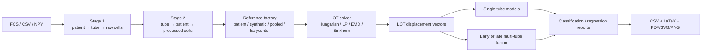

# FlowLOT

FlowLOT is an installable Python 3.12 package for Linear Optimal Transport (LOT)
representations of variable-size, multi-tube flow/mass cytometry samples. It
provides patient-centric ingestion, tube-centric analytics, multiple reference
distributions and OT solvers, missing-tube-aware prediction, and publication-grade
benchmark reporting.

The package formalizes the earlier exploratory `FlowCode.zip` notebooks. Those
experiments used BLAST110 (four panels), LAIP29, and FlowCAP-II AML; sampled 500,
1,000, or 2,000 events; aligned a preferred 12-channel subset; compared
Hungarian, Sinkhorn, linear-programming, and EMD transport; and quantified blast
or LAIP/WBC percentages with LOT+PLS. FlowLOT preserves the legacy Fortran-order
LOT flattening as an explicit option while making the mathematically standard
mass-weighted displacement embedding the default.



## Installation

```bash
python3.12 -m venv .venv
source .venv/bin/activate
pip install -e .
# Optional FCS reader and notebook tools:
pip install -e '.[fcs,notebook]'
```

## Quick start

Create an ingestion manifest:

```csv
patient_id,tube_id,path,label,markers
P001,tube1,data/P001_t1.npy,AML,FSC-A;SSC-A;CD45;CD34
P001,tube2,data/P001_t2.csv,AML,
P002,tube1,data/P002_t1.fcs,control,
```

Then build both HDF5 stages, create a marker subset, and compute LOT:

```bash
flowlot-build stage1 --manifest manifest.csv --output stage1_raw_data.h5 \
  --dataset BLAST110 --cells 1000
flowlot-build stage2 --stage1 stage1_raw_data.h5 --output stage2_analytics.h5 \
  --dataset BLAST110 --cells 1000
flowlot-build preprocess --stage2 stage2_analytics.h5 --dataset BLAST110 \
  --cells 1000 --id common12 \
  --markers FSC-A,FSC-H,SSC-A,SSC-H,FITC-A,PE-A,PerCP-A,PC7-A,APC-A,APC-H7-A,'Horizon V450-A','Horizon V500-A'
flowlot-run --stage2 stage2_analytics.h5 --dataset BLAST110 --cells 1000 \
  --preprocess common12 --reference patient0 --solver sinkhorn
flowlot-eval --stage2 stage2_analytics.h5 --dataset BLAST110 --cells 1000 \
  --preprocess common12 --embedding patient0_sinkhorn --task classification \
  --fusion early --output results/blast110
```

## Pipeline Notebooks

The end-to-end pipeline is structured into reproducible, ordered notebooks:

1. **[`NB01_Sampling_from_Raw_measurements.ipynb`](notebooks/NB01_Sampling_from_Raw_measurements.ipynb)** — *Raw Data Ingestion & Sampling*: Discovers FCS, CSV, and NPY datasets (`BLAST110`, `LAIP29`, `FLOWCAPII`), standardizes marker metadata with FlowIO, and writes nested subsampled tiers (500, 1,000, 5,000 cells) to Stage 1 HDF5 files (`data/stage1/`).
2. **[`NB02_Organizing_sampled_data_and_preprocessing.ipynb`](notebooks/NB02_Organizing_sampled_data_and_preprocessing.ipynb)** — *Stage 2 Organization & Preprocessing*: Restructures Stage 1 into tube-centric Stage 2 HDF5 (`stage2_analytics.h5`), aligns marker panels, applies arcsinh transformation ($\theta=500$), and normalizes marker distributions.
3. **[`NB03_lot_embeddings.ipynb`](notebooks/NB03_lot_embeddings.ipynb)** — *Linear Optimal Transport Embeddings*: Computes reference templates (patient baseline, pooled, Wasserstein barycenter), solves OT plans via EMD or Sinkhorn, and caches dual displacement and map representations.
4. **[`NB04_p1_Classification_split_n_NSC.ipynb`](notebooks/NB04_p1_Classification_split_n_NSC.ipynb)** — *Classification Splits & Nearest Subspace Classifiers*: Establishes balanced nested train/test splits ($k \in [2, 8]$) and evaluates Nearest Subspace Classifiers (`nsc`, `nsc_energy`, `nsc_full`) across single-tube and multi-tube fusion strategies.
5. **[`NB04_p2_aggregate_all_classification_result.ipynb`](notebooks/NB04_p2_aggregate_all_classification_result.ipynb)** — *Benchmark Scaling & Leaderboards*: Aggregates repeated benchmark shards, evaluates cell-count scaling frontiers ($N \in \{500, 1000, 5000\}$), and benchmarks FlowLOT against deep point-cloud / set baselines.
6. **[`NB05_Visualization.ipynb`](notebooks/NB05_Visualization.ipynb)** — *Latent Manifolds & Trajectory Visualization*: Visualizes LOT manifolds (PCA, UMAP), computes discriminant trajectory vectors ($\hat{v}$), and generates publication-grade directional marginal density evolution plots.
7. **[`NB06_Estimation_cMRD.ipynb`](notebooks/NB06_Estimation_cMRD.ipynb)** — *Computational MRD (cMRD) Estimation*: Performs continuous blast and LAIP percentage quantification via LOT embeddings and PLS regression across cell tiers, evaluating calibration transfer.

*Supplemental analysis:*
- **[`analyze_results.ipynb`](analyze_results.ipynb)**: Interactive notebook for inspecting benchmark result directories, summary metrics, and performance curves.

The construction notebooks use explicit `RUN_BUILD`/`RUN_ORGANIZE` safety
switches so audits can be reviewed before an HDF5 file is changed.

Classification outputs include Accuracy, Balanced Accuracy, Macro F1, ROC-AUC,
and PR-AUC. Balanced Accuracy and Macro F1 are the primary comparison metrics
because they weight minority classes appropriately.

See [the tutorial](docs/tutorial.md), [data architecture](docs/data_architecture.md),
[shared-split HPC benchmarks](docs/repeated_benchmark.md),
[knowledge map](docs/knowledge_map.md), and machine-readable
[Stage 2 schema](docs/stage2_schema.json). The earlier deep baselines remain
available through `flowlot.models.baselines` and the top-level `evaluate.py`.

## Citation

If you use FlowLOT in your research, please cite our arXiv preprint:

```bibtex
@misc{pathan2026flowlotlinearizedoptimaltransport,
      title={FlowLOT: Linearized Optimal Transport for Flow Cytometry Analysis}, 
      author={Naqib Sad Pathan and Mohammad Shifat-E-Rabbi and Kristofor E. Pas and Ivan Medri and Bartek Rajwa and Gustavo K. Rohde},
      year={2026},
      eprint={2609.17906},
      archivePrefix={arXiv},
      primaryClass={q-bio.QM},
      url={https://arxiv.org/abs/2609.17906}, 
}
```

## License

Copyright (c) 2026 Naqib Sad Pathan and Rohde Lab, University of Virginia. All rights reserved.

This repository is publicly available for academic review, research evaluation, and peer-review reproducibility only. No commercial license, express or implied, or patent license is granted. For commercial licensing inquiries or permissions, please contact the University of Virginia Licensing & Ventures Group (LVG).

