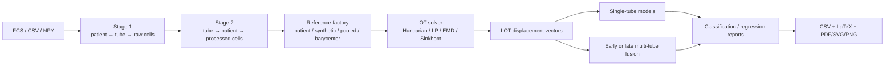

# FlowLOT

FlowLOT is an installable Python 3.12 package for Linear Optimal Transport (LOT)
representations of variable-size, multi-tube flow/mass cytometry samples. It
provides patient-centric ingestion, tube-centric analytics, multiple reference
distributions and OT solvers, missing-tube-aware prediction, and publication-grade
benchmark reporting.

The package formalizes the earlier exploratory `FlowCode.zip` notebooks. Those
experiments used BLAST110 (four panels), LAIP29, and FlowCAP-II AML; sampled 500,
1,000, or 2,000 events; aligned a preferred 12-channel subset; compared
Hungarian, Sinkhorn, linear-programming, and EMD transport; and quantified blast
or LAIP/WBC percentages with LOT+PLS. FlowLOT preserves the legacy Fortran-order
LOT flattening as an explicit option while making the mathematically standard
mass-weighted displacement embedding the default.



## Installation

```bash
python3.12 -m venv .venv
source .venv/bin/activate
pip install -e .
# Optional FCS reader and notebook tools:
pip install -e '.[fcs,notebook]'
```

## Quick start

Create an ingestion manifest:

```csv
patient_id,tube_id,path,label,markers
P001,tube1,data/P001_t1.npy,AML,FSC-A;SSC-A;CD45;CD34
P001,tube2,data/P001_t2.csv,AML,
P002,tube1,data/P002_t1.fcs,control,
```

Then build both HDF5 stages, create a marker subset, and compute LOT:

```bash
flowlot-build stage1 --manifest manifest.csv --output stage1_raw_data.h5 \
  --dataset BLAST110 --cells 1000
flowlot-build stage2 --stage1 stage1_raw_data.h5 --output stage2_analytics.h5 \
  --dataset BLAST110 --cells 1000
flowlot-build preprocess --stage2 stage2_analytics.h5 --dataset BLAST110 \
  --cells 1000 --id common12 \
  --markers FSC-A,FSC-H,SSC-A,SSC-H,FITC-A,PE-A,PerCP-A,PC7-A,APC-A,APC-H7-A,'Horizon V450-A','Horizon V500-A'
flowlot-run --stage2 stage2_analytics.h5 --dataset BLAST110 --cells 1000 \
  --preprocess common12 --reference patient0 --solver sinkhorn
flowlot-eval --stage2 stage2_analytics.h5 --dataset BLAST110 --cells 1000 \
  --preprocess common12 --embedding patient0_sinkhorn --task classification \
  --fusion early --output results/blast110
```

## Audited notebook workflow

Run the focused notebooks in order:

1. [`01_raw_to_stage1.ipynb`](notebooks/01_raw_to_stage1.ipynb) audits raw-file
   manifests, builds the patient-centric HDF5, and reports per-dataset statistics.
2. [`02_stage1_to_stage2.ipynb`](notebooks/02_stage1_to_stage2.ipynb) performs
   tube organization/preprocessing and validates raw, processed, and LOT shapes.
3. [`03_lot_embeddings.ipynb`](notebooks/03_lot_embeddings.ipynb) computes and
   stores multiple reference/solver LOT representations inside Stage 2.
4. [`03_split_verification.ipynb`](notebooks/03_split_verification.ipynb) creates
   and proves the balanced, nested, disjoint shared classification splits.
5. [`04_classification_analysis.ipynb`](notebooks/04_classification_analysis.ipynb)
   verifies HPC completion and produces rankings, bootstrap CIs, and diagnostics.

The construction notebooks use explicit `RUN_BUILD`/`RUN_ORGANIZE` safety
switches so audits can be reviewed before an HDF5 file is changed.

Classification outputs include Accuracy, Balanced Accuracy, Macro F1, ROC-AUC,
and PR-AUC. Balanced Accuracy and Macro F1 are the primary comparison plots
because they weight minority classes more appropriately than raw Accuracy.

See [the tutorial](docs/tutorial.md), [data architecture](docs/data_architecture.md),
[shared-split HPC benchmarks](docs/repeated_benchmark.md),
[knowledge map](docs/knowledge_map.md), and machine-readable
[Stage 2 schema](docs/stage2_schema.json). The earlier deep baselines remain
available through `flowlot.models.baselines` and the top-level `evaluate.py`.
