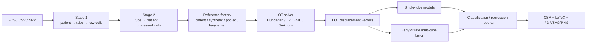

# FlowLOT

FlowLOT is an installable Python 3.12 package for Linear Optimal Transport (LOT)
representations of variable-size, multi-tube flow/mass cytometry samples. It
provides patient-centric ingestion, tube-centric analytics, multiple reference
distributions and OT solvers, missing-tube-aware prediction, and publication-grade
benchmark reporting.

The package formalizes the earlier exploratory `FlowCode.zip` notebooks. Those
experiments used BLAST110 (four panels), LAIP29, and FlowCAP-II AML; sampled 500,
1,000, or 2,000 events; aligned a preferred 12-channel subset; compared
Hungarian, Sinkhorn, linear-programming, and EMD transport; and quantified blast
or LAIP/WBC percentages with LOT+PLS. FlowLOT preserves the legacy Fortran-order
LOT flattening as an explicit option while making the mathematically standard
mass-weighted displacement embedding the default.



## Installation

```bash
python3.12 -m venv .venv
source .venv/bin/activate
pip install -e .
# Optional FCS reader and notebook tools:
pip install -e '.[fcs,notebook]'
```

## Quick start

Create an ingestion manifest:

```csv
patient_id,tube_id,path,label,markers
P001,tube1,data/P001_t1.npy,AML,FSC-A;SSC-A;CD45;CD34
P001,tube2,data/P001_t2.csv,AML,
P002,tube1,data/P002_t1.fcs,control,
```

Then build both HDF5 stages, create a marker subset, and compute LOT:

```bash
flowlot-build stage1 --manifest manifest.csv --output stage1_raw_data.h5 \
  --dataset BLAST110 --cells 1000
flowlot-build stage2 --stage1 stage1_raw_data.h5 --output stage2_analytics.h5 \
  --dataset BLAST110 --cells 1000
flowlot-build preprocess --stage2 stage2_analytics.h5 --dataset BLAST110 \
  --cells 1000 --id common12 \
  --markers FSC-A,FSC-H,SSC-A,SSC-H,FITC-A,PE-A,PerCP-A,PC7-A,APC-A,APC-H7-A,'Horizon V450-A','Horizon V500-A'
flowlot-run --stage2 stage2_analytics.h5 --dataset BLAST110 --cells 1000 \
  --preprocess common12 --reference patient0 --solver sinkhorn
flowlot-eval --stage2 stage2_analytics.h5 --dataset BLAST110 --cells 1000 \
  --preprocess common12 --embedding patient0_sinkhorn --task classification \
  --fusion early --output results/blast110
```

## Audited notebook workflow

The end-to-end pipeline is structured into reproducible, ordered notebooks executed in sequence:

1. **[`NB01_Sampling_from_Raw_measurements.ipynb`](notebooks/NB01_Sampling_from_Raw_measurements.ipynb)** — *Raw Ingestion & Multi-Level Cell Sampling to Stage 1*
   - Discovers raw cytometry datasets (`BLAST110`, `LAIP29`, `FLOWCAPII`) in FCS, CSV, or NPY formats.
   - Extracts and standardizes channel/marker metadata using FlowIO.
   - Constructs validated patient manifests and writes nested subsampled event tiers (500, 1,000, 5,000 cells) into per-dataset Stage 1 HDF5 files (`data/stage1/`).

2. **[`NB02_Organizing_sampled_data_and_preprocessing.ipynb`](notebooks/NB02_Organizing_sampled_data_and_preprocessing.ipynb)** — *Stage 1 to Tube-Centric Stage 2 Analytics*
   - Audits Stage 1 data and restructures into tube-centric Stage 2 HDF5 files (`data/stage2/stage2_analytics.h5`).
   - Configures marker alignment policies (`strict` vs. `intersection`) and channel subsets (e.g., common 12-marker panels).
   - Generates preprocessed cell matrices ready for optimal transport embedding.

3. **[`NB03_lot_embeddings.ipynb`](notebooks/NB03_lot_embeddings.ipynb)** — *Compute & Store Linear Optimal Transport Embeddings*
   - Computes empirical sample measures and reference distributions (patient baselines, synthetic, pooled, or Wasserstein barycenters).
   - Solves Monge/Kantorovich transport maps using multiple OT solvers (exact LP/EMD and entropic Sinkhorn).
   - Stores dual LOT representations (displacement vectors and sorted cell transport matrices) under `lot_embeddings/{preprocess_id}/{embedding_id}` in Stage 2 with convergence and transport cost diagnostics.

4. **[`NB04_p1_Classification_split_n_NSC.ipynb`](notebooks/NB04_p1_Classification_split_n_NSC.ipynb)** — *Classification Splits & Nearest Subspace Classifiers (NSC)*
   - Generates balanced, nested, disjoint patient training/testing splits across sample sizes ($k \in [2, 4, 6, 8]$ patients per class).
   - Evaluates LOT representations against Nearest Subspace Classifiers (standard NSC, energy-thresholded NSC, and uncentered full-rank NSC).
   - Implements dynamic multi-tube aggregation (single tube, early feature concatenation, late soft/hard probability fusion, and missing-tube handling) with complete confusion matrix analysis.

5. **[`NB04_p2_aggregate_all_classification_result.ipynb`](notebooks/NB04_p2_aggregate_all_classification_result.ipynb)** — *Cross-Cell-Count Scaling Analysis & Leaderboards*
   - Aggregates multi-tube repeated benchmark results across cohorts (`BLAST110` and `FLOWCAPII`).
   - Compares scaling frontiers across cell subsampling depths (500 vs. 1,000 vs. 5,000 cells) evaluating diagnostic performance against computational complexity, runtime, and memory footprint.
   - Generates leaderboards comparing classical classifiers with deep cell-set baselines (CellCNN, FlowSOM, Attention-MIL, CytoSet, DGCNN, PointNet++).

6. **[`NB05_Visualization.ipynb`](notebooks/NB05_Visualization.ipynb)** — *Interpretability, Latent Manifolds & Marginal Distributions*
   - Analyzes LOT latent embedding manifolds via PCA and UMAP.
   - Derives discriminant trajectory vectors ($\\hat{v} = \\frac{\\mu_{\\text{AML}} - \\mu_{\\text{NBM}}}{\\|\\mu_{\\text{AML}} - \\mu_{\\text{NBM}}\\|}$) between control and AML populations.
   - Renders publication-ready directional marginal density evolution plots along phenotypic trajectories with semantically aligned color palettes.

7. **[`NB06_Estimation_cMRD.ipynb`](notebooks/NB06_Estimation_cMRD.ipynb)** — *Computational Minimal Residual Disease (cMRD) Estimation*
   - Performs continuous blast and LAIP/WBC percentage quantification using LOT embeddings paired with Partial Least Squares (PLS) regression.
   - Evaluates particle count sensitivity across subsampled tiers (500, 1,000, 5,000 cells) to establish geometric linearization stability at lower cell counts.
   - Computes regression diagnostics ($R^2$, RMSE, MAE) and assesses within-cohort vs. cross-cohort calibration transfer.

*Supplemental analysis:*
- **[`analyze_results.ipynb`](analyze_results.ipynb)**: Interactive notebook for inspecting benchmark result directories, shard summaries, and plotting performance curves.

The construction notebooks use explicit `RUN_BUILD`/`RUN_ORGANIZE` safety
switches so audits can be reviewed before an HDF5 file is changed.

Classification outputs include Accuracy, Balanced Accuracy, Macro F1, ROC-AUC,
and PR-AUC. Balanced Accuracy and Macro F1 are the primary comparison plots
because they weight minority classes more appropriately than raw Accuracy.

See [the tutorial](docs/tutorial.md), [data architecture](docs/data_architecture.md),
[shared-split HPC benchmarks](docs/repeated_benchmark.md),
[knowledge map](docs/knowledge_map.md), and machine-readable
[Stage 2 schema](docs/stage2_schema.json). The earlier deep baselines remain
available through `flowlot.models.baselines` and the top-level `evaluate.py`.
