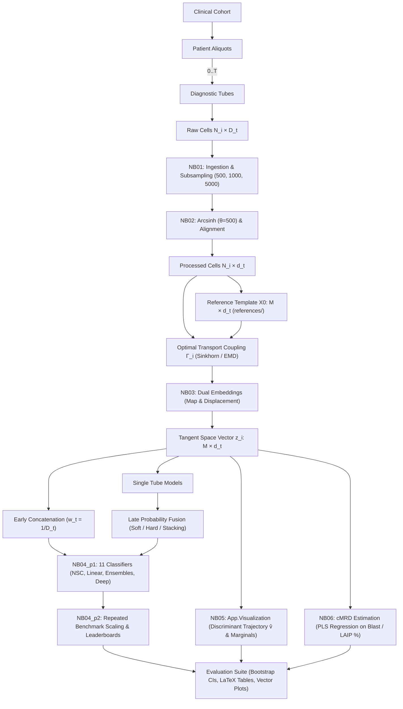

# FlowLOT knowledge map

## Concept map

## Agent routing table

| Goal | Primary module | Input → output |
|---|---|---|
| Ingest raw cytometric data | `flowlot.io.stage1_builder` / `stage1_migrator` | FCS/CSV/NPY manifest → Stage 1 HDF5 |
| Reorganize & marker alignment | `flowlot.io.stage2_organizer` | Stage 1 → Stage 2 analytical HDF5 |
| Programmatic HDF5 access | `flowlot.io.h5_loader` (`Stage2Loader`) | Stage 2 path → NumPy arrays/metadata |
| Common reference templates | `flowlot.reference.reference_factory` | Patient clouds → reference $[M, d_t]$ |
| Optimal transport solvers | `flowlot.transport.solvers` | Sample/reference clouds → coupling $\Gamma$ |
| Parallel & dual LOT embedding | `flowlot.transport.lot_engine` | Stage 2 processed cells → tangent vectors & persistent references |
| Classical tangent classifiers | `flowlot.models.classical` | Tangent vectors $\to$ predictions (`nsc`, `nsc_energy`, `nsc_full`, logistic, SVM, RF, ET, XGBoost) |
| Deep set & point-cloud baselines | `flowlot.models.baselines` & `evaluate.py` | Raw/subsampled bags $\to$ predictions (`cellcnn`, `attention_mil`, `cytoset`, `dgcnn`, `pointnet2`, `flowsom`) |
| Multi-tube fusion | `flowlot.models.fusion` | Tube vectors $\to$ early concatenation, late voting, or stacking |
| Repeated benchmark execution | `flowlot.evaluation.repeated_benchmark` | Stage 2 coordinates $\to$ shared splits, job shards, bootstrap CIs |
| Discriminant trajectory & manifolds | `flowlot.App.Visualization` (`visualization_utils`) | Tangent vectors $\to$ $\hat{v}$ projections & directional marginal densities |
| Continuous quantification & cMRD | `flowlot.evaluation` & `NB06` | Tangent vectors $\to$ PLS regression on blast/LAIP percentages |
| Publication reporting & figures | `flowlot.evaluation.reporting` | Benchmark/quantification metrics $\to$ LaTeX tables, SVG/PDF plots |

## Audited pipeline notebooks

1. **[`NB01_Sampling_from_Raw_measurements.ipynb`](../notebooks/NB01_Sampling_from_Raw_measurements.ipynb):** Discovers raw FCS/CSV/NPY measurements (`BLAST110`, `LAIP29`, `FLOWCAPII`), extracts FlowIO metadata, standardizes marker manifests, and writes nested subsampled tiers (500, 1,000, 5,000 cells) into Stage 1 (`data/stage1/`).
2. **[`NB02_Organizing_sampled_data_and_preprocessing.ipynb`](../notebooks/NB02_Organizing_sampled_data_and_preprocessing.ipynb):** Audits Stage 1, restructures into tube-centric Stage 2 (`data/stage2/stage2_analytics.h5`), configures alignment policies (`strict` vs. `intersection`), applies arcsinh transformation ($\theta=500$), and standardized z-scores.
3. **[`NB03_lot_embeddings.ipynb`](../notebooks/NB03_lot_embeddings.ipynb):** Computes empirical reference distributions, solves optimal transport Monge maps, freezes persistent references in `tube['references']`, and stores dual representations (`_map` and `_disp`) with parallel solving (`n_jobs`).
4. **[`NB04_p1_Classification_split_n_NSC.ipynb`](../notebooks/NB04_p1_Classification_split_n_NSC.ipynb):** Creates balanced, nested, disjoint patient training/testing splits ($k \in [2, 16]$, with `--classes` support). Evaluates Nearest Subspace Classifiers (`nsc`, `nsc_energy`, `nsc_full`) and multi-tube fusion (`single`, `early_mean`, `late_soft`, `late_hard`, `stacking`).
5. **[`NB04_p2_aggregate_all_classification_result.ipynb`](../notebooks/NB04_p2_aggregate_all_classification_result.ipynb):** Aggregates repeated benchmark shards, evaluates scaling frontiers across cell subsampling tiers (500 vs. 1,000 vs. 5,000 cells) against OT complexity, and compiles leaderboards across 11 classifiers.
6. **[`NB05_Visualization.ipynb`](../notebooks/NB05_Visualization.ipynb):** Evaluates tangent space manifolds via PCA and UMAP, derives discriminant trajectory vectors ($\hat{v} = \frac{\mu_{\text{AML}} - \mu_{\text{NBM}}}{\|\mu_{\text{AML}} - \mu_{\text{NBM}}\|}$), and renders directional marginal density evolution plots via `flowlot.App.Visualization`.
7. **[`NB06_Estimation_cMRD.ipynb`](../notebooks/NB06_Estimation_cMRD.ipynb):** Performs continuous blast and LAIP/WBC percentage quantification using LOT embeddings paired with Partial Least Squares (PLS) regression across cell subsampling tiers (500, 1,000, 5,000 cells), evaluating calibration transfer.
- **[`analyze_results.ipynb`](../analyze_results.ipynb):** Supplemental interactive notebook for inspecting benchmark directories and plotting custom performance curves.

## Reference choices

- **Patient reference (`patient0`):** Maximally interpretable, physical biological baseline matching legacy protocols.
- **Pooled subsample (`pooled`):** Uniformly subsamples across training patients, capturing observed cellular heterogeneity while scaling efficiently.
- **Wasserstein barycenter (`barycenter`):** Fréchet mean under the $\mathcal{W}_2$ metric minimizing average transport discrepancy. Must be fit strictly on training patients.
- **Uniform / Gaussian controls:** Useful negative controls derived from empirical coordinate bounds or moments.
- **Persistent Reference Caching:** Templates are saved under `tube["references"]` to prevent stochastic sampling variations between runs.

## Solvers and computational complexity

- **Exact LP / EMD (`emd`):** Solves exact discrete Kantorovich problem via network simplex. Computationally intensive for large point clouds.
- **Hungarian matching (`hungarian`):** One-to-one discrete assignment requiring identical particle counts.
- **Entropic regularized Sinkhorn (`sinkhorn`):** Default for large clouds, computing optimal couplings via matrix scaling iterations.
- **The $N=1000$ Pareto Frontier:** Solving OT incurs worst-case super-quadratic complexity $\mathcal{O}(N^3 \log N)$. Subsampling $N=1000$ cells achieves near-optimal diagnostic accuracy ($96\text{--}98\%$) while avoiding the $>16\times$ runtime penalty of $N=5000$ cells.

## Multi-tube fusion mechanics

- **Early fusion (`early_mean`, `early_zero`):** Concatenates tangent displacement vectors with dimension-normalized weights $w_t = 1/D_t$ and imputes missing tubes using training-cohort means or zeros plus availability indicator features.
- **Late fusion (`late_soft`, `late_hard`):** Fits independent classifiers per tube and computes soft class posterior averages or majority voting.
- **Stacking (`stacking`):** Trains an out-of-fold meta-classifier across tube probability predictions.

## Reproducibility and leakage boundaries

Random seeds govern subsampling, references, cross-validation, and bootstraps.
References, marker statistics, early-fusion imputation, and all model fitting must
use training patients only in confirmatory studies. Stage 2 may hold exploratory global
embeddings, but they must not be reported as confirmatory cross-validation if
their reference was learned using held-out patients.

## Legacy experimental knowledge and deep baselines

The earlier deep baselines remain available through `flowlot.models.baselines` and the top-level `evaluate.py` / `train.py`.
The historical quantification workflow flattened LOT maps in Fortran order (`order="F"`), used PLS regression
on log10 percentages, compared within-cohort and BLAST110→LAIP29 transfer, and
reported LAIP thresholds at 0.1%, 1%, and 5% with Dx/FU marker shapes. The clinical reporting suite
retains that visual vocabulary while exporting publication PDF, SVG, and high-resolution PNG.

