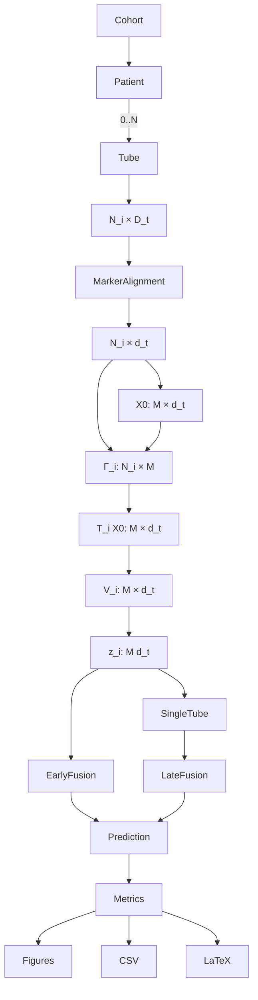

# FlowLOT knowledge map

## Concept map

## Agent routing table

| Goal | Primary module | Input → output |
|---|---|---|
| Ingest cell tables | `flowlot.io.stage1_builder` | manifest → Stage 1 HDF5 |
| Reorganize/alignment | `flowlot.io.stage2_organizer` | Stage 1 → Stage 2 |
| Inspect matrices/vectors | `flowlot.io.h5_loader` | Stage 2 path → NumPy |
| Choose common support | `flowlot.reference.reference_factory` | patient clouds → `[M,D]` |
| Solve OT | `flowlot.transport.solvers` | target/reference → coupling |
| Compute/save LOT | `flowlot.transport.lot_engine` | Stage 2 processed → vectors |
| Predict outcome | `flowlot.models` | vectors or bags → outputs |
| Fuse tubes | `flowlot.models.fusion` | sparse tube maps → features/predictions |
| Score/report | `flowlot.evaluation` | labels/predictions → metrics/artifacts |

## Reference choices

- **Patient reference:** maximally interpretable and matches the legacy patient-0
  experiments, but results depend on that subject.
- **Uniform/Gaussian:** useful negative controls derived from empirical bounds or
  moments; neither preserves multimodal immunophenotypes.
- **Pooled subsample:** represents observed cells and scales well.
- **Wasserstein barycenter:** minimizes average transport discrepancy and is less
  patient-specific, but is the most expensive and must be fitted inside each
  training fold for unbiased benchmarking.

## Solvers

Hungarian matching is one-to-one and therefore requires equal cell counts. Exact
EMD and linear programming support unequal sizes but scale poorly. Entropic
Sinkhorn is the default for larger clouds; `reg` controls smoothness/bias. Stored
costs and convergence flags are required audit fields.

## Missing tube strategies

Early fusion concatenates tube vectors in a fixed order, imputes missing vectors
with training means or zeros, and appends availability indicators. Late fusion
fits one estimator per tube and averages/medians available outputs. Stacking uses
out-of-fold tube predictions for its meta-model. A patient with no observed tube
cannot be predicted and raises an error.

## Reproducibility and leakage boundaries

Random seeds govern subsampling, references, cross-validation, and bootstraps.
References, marker statistics, early-fusion imputation, and all model fitting must
use training patients only in final studies. Stage 2 may hold exploratory global
embeddings, but they should not be reported as confirmatory cross-validation if
their reference was learned using held-out patients.

## Legacy experimental knowledge

`FlowCode.zip` contains BLAST110, LAIP29, and FlowCAP-II ingestion notebooks.
The preferred shared channels were FSC-A, FSC-H, SSC-A, SSC-H, FITC-A, PE-A,
PerCP-A, PC7-A, APC-A, APC-H7-A, Horizon V450-A, and Horizon V500-A. The
quantification workflow flattened LOT maps in Fortran order, used PLS regression
on log10 percentages, compared within-cohort and BLAST110→LAIP29 transfer, and
reported LAIP thresholds at 0.1%, 1%, and 5% with Dx/FU marker shapes. The new
`plot_clinical_threshold_suite` retains that visual vocabulary while exporting
PDF, SVG, and 300-dpi PNG.
